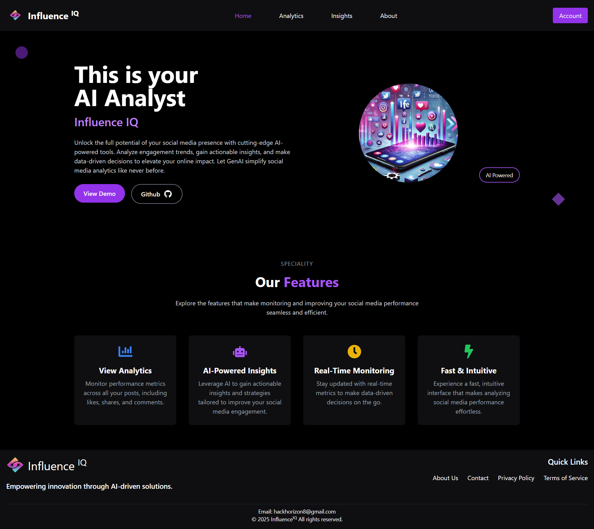
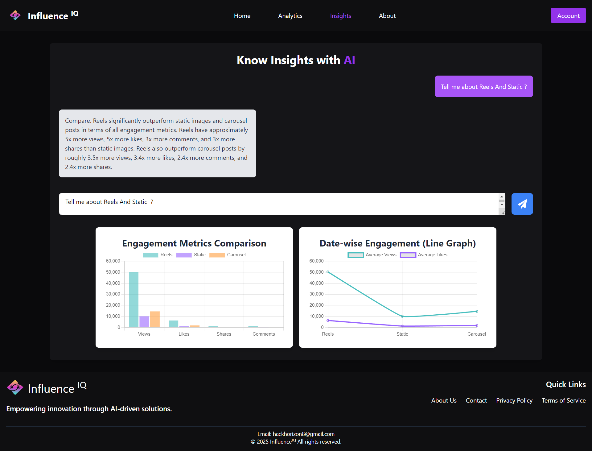

# 📊 Social Media Analyzer

An GenAI based Web application designed to analyze and visualize social media data, providing insights into post performance across various platforms.

---

## 🚀 Features

- **Data Visualization**: Interactive charts and graphs to represent social media metrics.
- **Post Performance Analysis**: Evaluate engagement metrics such as likes, shares, views, and comments.
- **Content Comparison**: Compare performance across different social posts.

---

## 🛠️ Technologies Used

- **Frontend**:
  - ReactJS
  - Tailwind CSS
   
- **Backend**:
  - Astra DB
  - Langflow
   
---

## 📁 Project Structure
```plain text
📂 socialmedia-analyzer
├── 📂 backend
│   ├── 📄 index.js               # Backend entry point
│   ├── 📄 .env                   # Environment variables
│   ├── 📄 package.json           # Backend dependencies
│   └── 📄 secure-connect-dummyone.zip # DataStax connection credentials
├── 📂 frontend
│   ├── 📂 src
│   │   ├── 📂 components         # Reusable React components
│   │   ├── 📂 pages              # Individual app pages
│   │   ├── 📄 App.jsx            # Main React component
│   │   ├── 📄 index.css          # Global styles
│   │   ├── 📄 main.jsx           # React DOM rendering
│   │   └── 📄 Router.jsx         # App routing logic
│   ├── 📄 package.json           # Frontend dependencies
│   ├── 📄 index.html             # HTML template
│   └── 📄 tailwind.config.js     # Tailwind CSS configuration
├── 📄 README.md                  # Project documentation
└── 📄 .gitignore                 # Ignored files for Git

```


## 📷 Photos




-----

## 📽️ Demo Video

[Demo Video](https://youtu.be/AI5_LbOnXm0)
